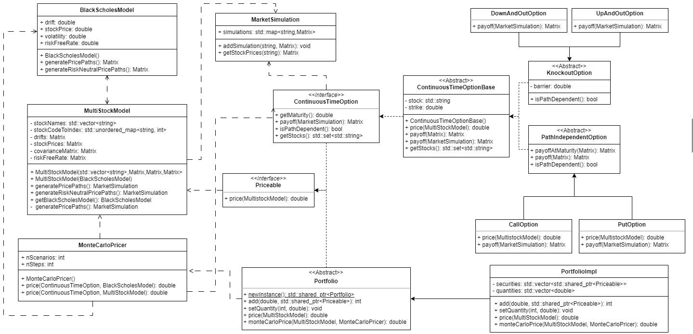

# FinMatLib

## Contents
* [Overiew](#overview)
* [Class Structure](#structure)
* [Component Description](#description)
* [Usage](#usage)

## Overview
FinMatLib is a tools library for option pricing and financial modeling. It is designed to model, simulate, and price various financial instruments, specifically options, with an extensible multi-asset framework. 

### Key Features
- **Financial Models**: Includes implementations of the Black-Scholes and Multi-Stock models for single and multi-asset pricing.
- **Option Pricing**: Supports a variety of options including path-independent and knockout options, with both analytic and Monte Carlo pricing methods.
- **Portfolio Management**: Provides aggregation and pricing of diverse financial instruments in a portfolio.

### Design Patterns
The architecture of is influenced by several design patterns:
- **Abstract Factory**: Used for creating families of related financial models and options without specifying their concrete classes.
- **Template Method**: Defines the general workflow for pricing and payoff calculations, allowing subclasses to specify particular steps.
- **Factory Method**: Used for hiding the implementation details, so that the portfolio interface's behavior can be changed without affecting functionality.
- **Command**: Used to encapsulate pricing tasks as independent commands, enabling multi-threaded execution in the MonteCarloPricer.

## Class Structure

<br>
<p align="center">
 
<br>
Object Model
</p>
<br>

## Components and Their Interaction

`BlackScholesModel`: This class models the Black-Scholes framework for a single asset, including the ability to generate price paths under different assumptions, such as real-world and risk-neutral measures.

`MultiStockModel`: This class extends the single-asset Black-Scholes model to a multi-asset framework. It handles multiple stocks, their correlations, and allows the generation of simulated price paths across these assets.

`MarketSimulation`:This class stores and manages simulations of the market, allowing other components to retrieve stock price histories for different scenarios.

`MonteCarloPricer`: This utility class prices options using Monte Carlo simulations, which involve generating a large number of possible price paths and averaging the payoffs.

`Priceable`: Interface class to represent different instruments.

`ContinuousTimeOption`: An interface that defines the basic structure for all continuous-time options, requiring implementations for methods to retrieve maturity, calculate payoffs, and determine path dependency.

`ContinuousTimeOptionBase`: A base class providing common functionality for continuous-time options, including basic price calculations and payoff methods.

`PathIndependentOption`: A specialized option class for path-independent options, which are only dependent on the final stock prices at maturity.

`KnockoutOption`: A class representing knockout options, which cease to exist if the underlying asset's price reaches a certain barrier level.

`Portfolio`: This class represents a collection of financial instruments, allowing for the aggregation and management of multiple `Priceable` objects.

`PortfolioImpl`: A concrete implementation of `Portfolio` that manages a collection of securities and their corresponding quantities.

## Interaction and Workflow

1. **Model Setup**: The `BlackScholesModel` or `MultiStockModel` is initialized with parameters like date, drift, volatility, and correlations.
2. **Simulation**: `MarketSimulation` provides an identity-based map for different future stock price scenarios generated by the `MultiStockModel` class.
3. **Option Pricing**: `PathIndependentOption` computes payoffs based solely on the final stock prices at maturity, whereas `KnockoutOption` considers the entire price path.
4. **Portfolio Management**: `Portfolio` aggregates various options, allowing for combined pricing and risk management strategies.
5. **Monte Carlo Pricing**: The `MonteCarloPricer` provides a method for estimating the value of options with different payoff methods.

## Usage
For using as a shared library:
```sh
make static_lib
```
To compile with static libray:
```sh
g++ -o test_lib main.cpp -Llib -lFMLib
```
For using as a dynamic library:
```sh
make shared_lib
```
To compile with dynamic libray:
```sh
g++ -o test_lib main.cpp -Llib -lFMLib -Wl,-rpath=lib
```
